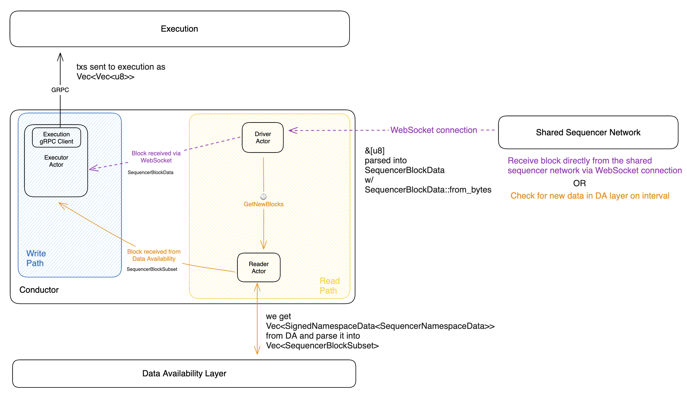

# Astria Conductor

The Astria Conductor connects the shared sequencer and data availability layers
to the execution layer, where the execution layer is a rollup execution
environment. There is one instance of the Conductor per rollup node.

> Note: this documentation is for the v1alpha2 API which is currently being
> implemented, and some of the documentation is on how it should be implemented,
> not how it is currently.

When a block is received, either from the Sequencer layer or from the DA layer,
the Conductor filters for the transactions that are in the rollup's namespace
and pushes them to the execution layer.

Blocks can be received via either:

- From the shared Sequencer via websocket
- The data availability layer, requested on a predefined interval

In the first case, the transactions in the block are filtered and pushed to the
execution layer, executed, and added to the blockchain. Transactions for new
blocks are sent to the execution layer and are immediately marked as `soft` once
an execution hash is returned from the rollup. Blocks are not finalized until
they are also received from the data
availability layer.

In the second case, batches of blocks are received from the DA layer and
filtered for the rollup. These blocks are then used to set their corresponding
blocks' commit status on the rollup as finalized/`firm`.

The exact terminology that a rollup uses for its fork choice rules is up to its
implementation. For example, Geth uses `head`, `safe`, and `final`. The
Conductor uses `soft` and `firm`. The fork choice options are mapped
with Geth in the following way:

- `soft` -> `safe`
  - The leading soft block is also the `head`
- `firm` -> `final`

To update the commitment level of a block on the rollup, the Conductor simply sends a
[`UpdateCommitmentState` message](https://buf.build/astria/astria/docs/main:astria.execution.v1alpha2#astria.execution.v1alpha2.ExecutionService.UpdateCommitmentState) to the rollup node.

## Architecture

The architecture of the Conductor is inspired by the [Actor
Model](https://en.wikipedia.org/wiki/Actor_model) with the actors within the
Conductor being the `Driver`, `Reader`, and `Executor`. Each actor operates
concurrently and communicates with the other actors by passing messages. The
Conductor is written in Rust and utilizes the Tokio runtime to achieve this.

### Driver

- The top level coordinator that runs and manages all the subcomponents necessary for the Conductor
- Creates the Reader and Executor actors on startup
- Connects to the Sequencer network via websocket
- Runs an event loop that handles receiving `DriverCommand`s from other actors
- Creates a `TendermintClient` to validate Sequencer blocks received from the
  sequencer
-  Passes validate sequencer blocks to the Executor for execution on the rollup

The Driver receives either `SequencerBlockData` blocks directly from the
Sequencer via websocket connection, or `DriverCommand`s ([link](https://github.com/astriaorg/astria/blob/6e71a76fa52c522ffdcabcd9d659e4de765d9d61/crates/astria-conductor/src/driver.rs#L54))
from the Conductor's internal event loop on a timer. The variant for  `DriverCommand` that is relevant to the processing of blocks within the
Conductor are:

- `DriverCommand::GetNewBlocks`([link](https://github.com/astriaorg/astria/blob/3c4e47dbe1818e4228691d6bfd2b2143a06f1a6e/crates/astria-conductor/src/driver.rs#L54))
  - This message triggers the sending of a `ReaderCommand::GetNewBlocks` to
    the Reader actor to initiate the pulling of data from the DA layer.

### Reader

- Creates a `CelestiaClient` to communicate with the DA layer
- Creates a `TendermintClient` which is used when validating blocks received
  from DA
- Runs an event loop that handles receiving `ReaderCommand`s that drive data
  retrieval from the DA layer
- Passes the blocks it receives to the `Executor`

The Reader receives a `ReaderCommand::GetNewBlocks`
([link](https://github.com/astriaorg/astria/blob/3c4e47dbe1818e4228691d6bfd2b2143a06f1a6e/crates/astria-conductor/src/driver.rs#L54))
message from the driver. The `CelestiaClient`
([link](https://github.com/astriaorg/astria/blob/3c4e47dbe1818e4228691d6bfd2b2143a06f1a6e/crates/astria-sequencer-relayer/src/data_availability.rs#L244))
is then called from the Reader to get data from the Celestia DA. This data is
then parsed from Celestia blobs into individual partial blocks (consisting of
relevant information needed for validation and the relevant rollup transactions by
namespace).
The block data is then validated to make sure that the proposer for the block is
the one expected. It also checks the commit of the parent block by verifying
that >2/3 staking power of the sequencer chain voted for it. Each block is then
transformed into a `SequencerBlockSubset` and handed off to the Executor along
with the command `ExecutorCommand::BlockReceivedFromDataAvailability`, then it
is sent to the rollup for execution.

### Executor

- Runs an event loop that handles receiving `ExecutorCommand`s from both the
  Driver and Reader
- Filters transactions by their rollup namespace and sends them to the rollup
  for execution
- Maps sequencer block hashes to execution block hashes so that blocks received
  from the sequencer and DA can be match and `firm` commits can be sent to the rollup
- Blocks are sent to the execution layer using [Astria’s GRPC Execution client
  interface](https://buf.build/astria/astria/docs/main:astria.execution.v1alpha2)
  - Rollups utilizing the Conductor must implement this interface
- If a block comes from the DA layer, an `UpdateCommitmentState` message is sent to the
  rollup

The `ExecutorCommand`
([link](https://github.com/astriaorg/astria/blob/eeffd2dc24ec14cbc7a3b3197ec2a3c099a78605/crates/astria-conductor/src/executor.rs#L81))
variants that the Executor receives are as follows:

- `ExecutorCommand::BlockReceivedFromGossipNetwork` commands are received when
  data comes from the Sequencer via the Driver.
- `ExecutorCommand::BlockReceivedFromDataAvailability` commands are received
  when data comes from the DA layer via the Reader.

When blocks are received from the sequencer, their transactions are
filtered based on the rollup's namespace, then are sent to the rollup for
execution. The execution hash that is returned from the rollup is then stored in
a hash map for Sequencer block hash -> execution hash.

When blocks are received from the DA layer, the hash map of Sequencer block hash
-> execution hash is checked to see if the block has already passed through the
Conductor from the Sequencer. If the block isn't seen, it is filtered and sent
to the rollup for execution exactly the same way the transactions are sent when
received from the Sequencer, then a message to finalize the block is sent. If
the block is already present in the hash map, just the finalize block message is
sent. After being finalized, the Sequencer block hash -> execution hash entry in
the hash map is deleted.

## Execution Data

### Transaction Filtering

An instance of the Conductor is meant to be run alongside the rollup node.

The `chain_id` that Conductor uses as the rollup's identifier is pulled from the
rollup's config. When a user submits a transaction to be sequenced, they specify
the `chain_id` of its destination.

When a Sequencer block is received, the Conductor
filters the transactions for its chain ID and executes only those transactions
on top of its parent state. See the [astria execution
api](https://github.com/astriaorg/astria/blob/main/specs/execution-api.md) for more details.

### Data Validation

Data is validated before being sent to the rollup for execution. Validation
occurs in two places:

- When blocks are received directly from the sequencer, the data is passed to
  `handle_block()` and validated with `BlockVerifier::validate_sequencer_block_data`
- When blocks are fetched from the DA layer, the data is validated in the Reader's
  `get_new_blocks` using `BlockVerifier::validate_signed_namespace_data` and
  `BlockVerifier::validate_rollup_data`

### Soft Commitments

When a block is received by the Conductor directly from the sequencer, it
is immediately set as a `soft` commitment.

As mentioned in the [Transaction Filtering](#transaction-filtering) section
above, the only information sent to the rollup is the list of ordered
transactions, the previous execution hash from the rollup, and timestamp (see
[ExecuteBlockRequest](https://buf.build/astria/astria/docs/main:astria.execution.v1alpha2#astria.execution.v1alpha2.ExecuteBlockRequest)).
It is the rollup node's responsibility to build their own specific block from
the data provided and return the execution hash that resulted from adding the new block.

The Conductor keeps a map of Sequencer block hashes to rollup execution hashes
for later matching when blocks are seen in the DA layer.

### Firm Commitments

When the Conductor pulls data from the DA, it compares the Sequencer block
hashes seen with those of the already executed blocks stored in the map
mentioned at the end of the [Soft Commitments](#soft-commitments) section. For
each block seen in DA that matches an executed block, a [`UpdateCommitState` message](https://buf.build/astria/astria/docs/main:astria.execution.v1alpha2#astria.execution.v1alpha2.ExecutionService.UpdateCommitmentState)
is sent to the rollup to set those blocks to `firm` and the entries in the
execution hash to Sequencer block hash map are cleared.

If blocks are seen in the DA data that haven't been seen from the sequencer, the
transactions in those blocks are filtered for the namespace and sent to the
rollup for execution as well as being set to `firm`.
