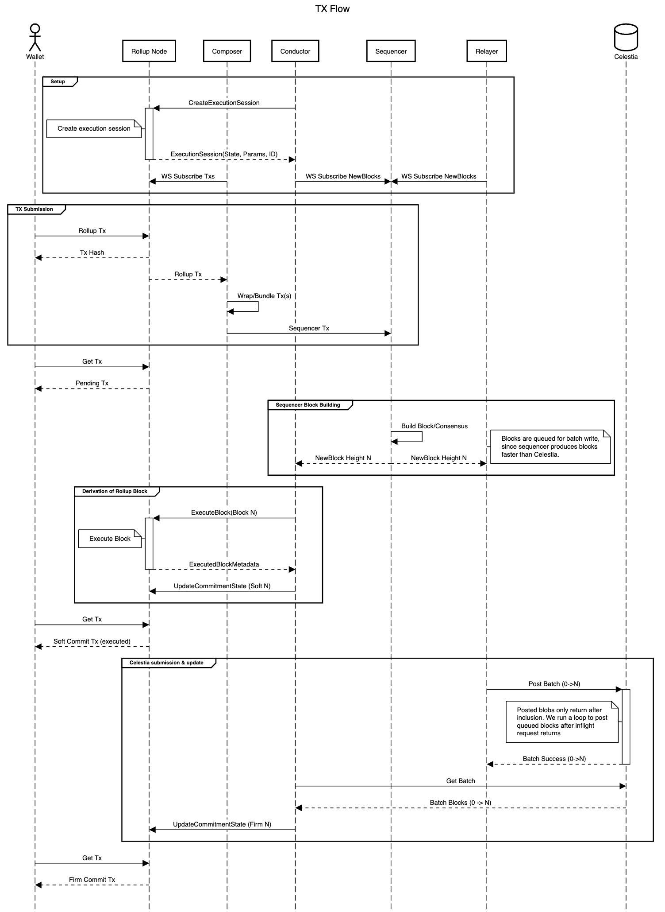

# Execution API Specification

## Overview

The Execution API is the interface `Conductor` uses to drive deterministic
derivation of rollup chain from sequencer blocks. Inspired by other APIs, such
as the Engine API and ABCI Consensus API, it is a chain agnostic mechanism
intended to be very simple to implement. It is a gRPC API which any state
machine can implement and use conductor with to drive their block creation to
integrate with the Astria Sequencer.

## Basic Design Principles

The Execution API is a resource based API with two resources: `Block` and
`CommitmentState`. The API is designed to follow basic principles outlined by
aip.dev as best practices for resource based APIs. gRPC has been chosen for the
API due to the wide availability of language implementations which make it easy
to generate client libraries and server implementations.  

## Conductor Usage

### Startup

Upon startup, conductor first grabs the basic genesis information via
`GetGenesisInfo`. After this succeeds, it  fetches the initial commitments in
the state machine via `GetCommitmentState`. If started on a fresh rollup
these will all be the same block. If running against a state machine with
previous block data, Conductor must also track the block hash of any blocks
between commitments, it will call `BatchGetBlocks` to get block information
between commitments.

### Restart

The conductor is able to gracefully restart under two scenarios:

1. Conductor recieves a `PermissionDenied` status from the execution layer when
calling `ExecuteBlock`. This is meant to function seamlessly with [`astria-geth`](https://github.com/astriaorg/astria-geth)'s
behavior upon an unexpected restart. If `geth` receives a `ExecuteBlock` request
before receving *both* `GetGenesisInfo` and `GetCommitmentState` (which will be
the case if the execution layer has restarted), it responds with a `PremissionDenied`
status, prompting the conductor to restart.
2. `GenesisInfo` contains a `rollup_stop_block_number` and has a `halt_at_rollup_stop_number`
value of `false`, indicating a planned restart after execution of the given block.
Once the conductor reaches the stop height, it will perform a restart in one of the
following ways corresponding to its mode:

    - **Firm Only Mode**: Once the stop height is reached for the firm block stream,
    the firm block at this height is executed (and commitment state updated) before
    restarting the conductor, prompting the rollup for a new `GenesisInfo` with
    new start/stop heights (and potentially chain IDs).
    - **Soft and Firm Mode**: Once the stop height is reached for the soft block
    stream, the block at this height will be executed. The conductor will then wait
    for the firm block at the stop height, execute it, and restart. If the firm
    block is executed first, conductor will restart immediately.
    - **Soft Only Mode**: Once the stop height is reached for the soft block stream,
    the block at this height is executed and Conductor restarts.

### Execution & Commitments

From the perspective of the sequencer:

- `SOFT` commitments have been fully committed to by the sequencer consensus.
- `FIRM` commitment indicates that the block has been written and has been
  propagated across the DA network.

When configuring conductor, you can configure the time at which blocks are
executed in your rollup using the `execution_commitment_level` in the config
file. If this is configured to a higher level of commitment, no action will be
taken upon receiving lower commitments.

`ExecuteBlock` is called to create a new rollup block when the
`execution_commitment_level` has been reached for a given block. Upon receipt of
a new block, the conductor calls `UpdateCommitmentState` to update the
commitment at the level of the `execution_commitment_level` and any level above
it.

`execution_commitment_level` options, and changes to execution:

- `SOFT`
  - upon receiving a new sequencer block N from sequencer:
    - `ExecuteBlock` will be called with data from the sequencer block N, then
    - `UpdateCommitmentState` will be called again to update the `SAFE` to N
  - upon reading new blocks from DA containing all of blocks K->N, where K is
    some arbitrary ancestor of N
    - `UpdateCommitmentState` will be called to update `FIRM` to N
- `FIRM`
  - conductor does not need to listen for new blocks from Sequencer
  - upon reading new blocks from DA containing all of blocks K->N
    - For each block M from K->N:
      - `ExecuteBlock` will be called with data from the sequencer block M
      - `UpdateCommitmentState` will be called to update `FIRM` and `SAFE` to M

Note: For our EVM rollup, we map the `CommitmentState` to the `ForkchoiceRule`:

- `SOFT` Commitment -> `HEAD` Forkchoice && `SAFE` Forkchoice
- `FIRM` Commitment -> `FINAL` Forkchoice

## Rollup Implementation Details

### GetGenesisInfo

`GetGenesisInfo` returns information which is definitional to the rollup with
regards to how it serves data from the sequencer & celestia networks, along with
optional block heights for initiating a [conductor restart](#restart). This RPC
should ***always*** succeed. The API is agnostic as to how the information is defined
in a rollup's genesis, and used by the conductor as configuration on startup *or*
upon a restart.

If the `GenesisInfo` provided by this RPC contains a `rollup_stop_block_number`,
the rollup should be prepared to provide an updated response when the conductor
restarts, including, at minimum, a new `rollup_start_block_number` and `sequencer_start_height`.
The updated response can also contain an updated `rollup_stop_block_number` (if
another restart is desired), `celestia_chain_id`, and/or `sequencer_chain_id`
(to facilitate network migration).

### ExecuteBlock

`ExecuteBlock` executes a set of given transactions on top of the chain
indicated by `prev_block_hash`. The following should be respected:

- `prev_block_hash` MUST match hash of the `SOFT` commitment state block, return
  `FAILED_PRECONDITION` otherwise.
- If block headers have timestamps, created block MUST have matching timestamp
- The CommitmentState is NOT modified by the execution of the block.

### GetBlock

`GetBlock` returns information about a block given either its `number` or
`hash`. If the block cannot be found return a `NOT_FOUND` error.

### BatchGetBlocks

`BatchGetBlocks` returns an array of Blocks which match the array of passed in
block identifiers.

- The API endpoint MUST fail atomically, returning either all requested resources
  or a `NOT_FOUND` error.
- The returned objects MUST be in the same order as they were requested.

### GetCommitmentState

`GetCommitmentState` returns the commitment state with rollup `Block` information
for each level of commitment.

### UpdateCommitmentState

`UpdateCommitmentState` replaces the `CommitmentState` in the sequencer.

- No commitment can ever decrease in block number on the blockchain, if this is
  attempted return a `FAILED_PRECONDITION` error.
- `SOFT` and `FIRM` block MUST either increase in block number OR match current
  commitment state block.
- `FIRM` blocks MUST be members of the block chain defined by `SAFE`
- Block numbers in state MUST be such that  `SOFT` >= `FIRM`, return a
  `FAILED_PRECONDITION` error if this is not true

## Sequence Diagram

The sequence diagram below shows the API used within the full context of Astria
stack. Demonstrating what happens between a user submitting a transactions, and
seeing it executed as well as before soft and firm commitments.

