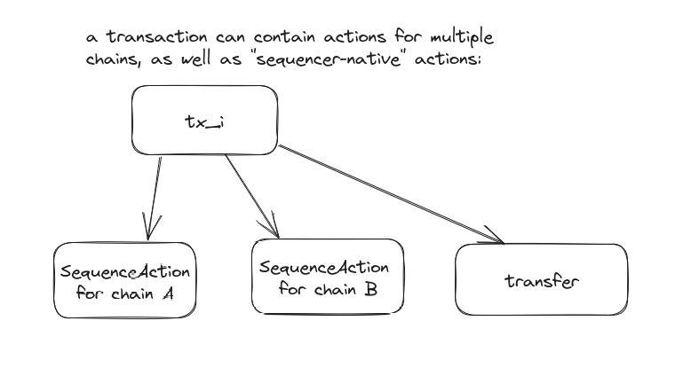
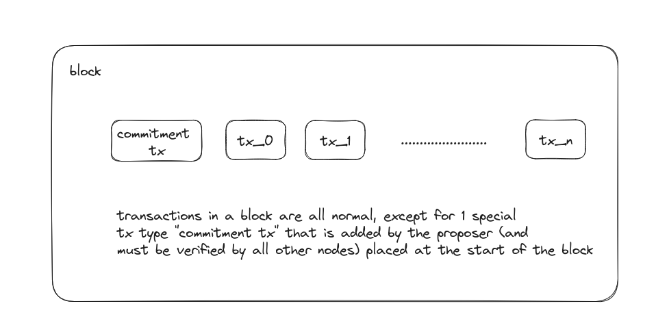
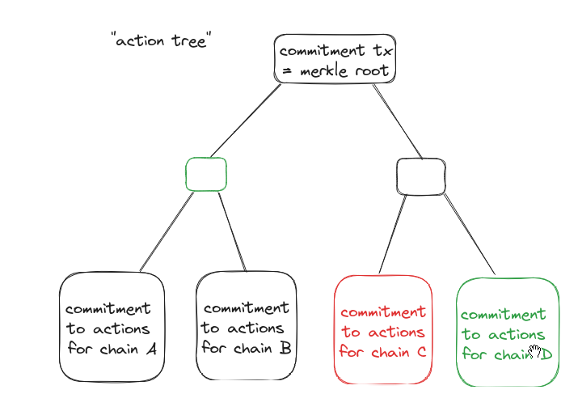
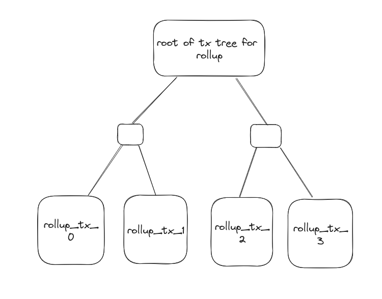

# Sequencer inclusion proofs

## Motivation and background

When the conductor receives a batch of rollup transactions that constitute the
next rollup block, it needs to verify that this batch of transactions is
actually part of a sequencer block, and that no transactions are missing. It
also needs to verify that the sequencer (cometbft) block it received is valid.
Specifically, it needs to verify:

- the batch of rollup transactions are all part of a specific sequencer block,
  and that the batch is not missing transactions
- the sequencer block's transactions merkleize to the correct `data_hash` in the
  sequencer block header (see the [Tendermint data structures
  spec](https://github.com/tendermint/spec/blob/master/spec/core/data_structures.md#header)).
- the sequencer block header merkleize to the correct sequencer `block_hash`
- the sequencer block with that `block_hash` was validly proposed (or committed,
  if it's a committed block)

## Implementation

A transaction on the sequencer consists of multiple "actions", each of which can
be either a sequencer-native transaction or a set of opaque bytes destined for a
rollup.

A rollup conductor needs to be able to verify its subset of relevant data
without needing to pull all the transaction data for a block. To do this, the
block proposer includes a special "commitment tx" at the start of the block.
This a special transaction type that can only be included by the proposer.

When building a block, the proposer deconstructs all txs into their contained
`sequence::Action`s and groups them all. Remember that 1 `sequence::Action`
corresponds to 1 rollup transaction. Then, a commitment to the set of all
actions for a chain becomes a leaf in a merkle tree, the root of which becomes
the "commitment tx"

Note that the batch of actions for a specific chain, as grouped by the proposer,
is the exact same as what's posted on the data availability layer, allowing for
easy inclusion proof verification. The merkle proof of inclusion of that the
batch of actions is included in "commitment tx" is also posted to the data
availability layer. Then, when the conductor pulls a blob for a chain, it
verifies the data in it by checking the merkle proof. The conductor also
verifies that "commitment tx" is included in the block header's `data_hash` (a
proof of inclusion in `data_hash` will also need to be posted).

For example:

- to verify txs for chain C, we fetch the rollup txs from the data availability
  layer and calculate the commitment which should match the leaf in red (in the
  above diagram)
- we use the inclusion proof (in green) to verify the txs for chain C were
  included in the action tree
- we verify a proof of inclusion of "commitment tx" (action tree root) inside
  the block header's `data_hash`
- we verify that `data_hash` was correctly included in the block's `block_hash`
- verify `block_hash`'s cometbft >2/3 commitment

We are now certain that the txs we fetched for rollup C were endorsed by >2/3
staking power of the sequencer chain.

Additionally, the commitment to the actions for a chain actually also includes a
merkle root. The commitment contains of the merkle root of a tree where where
the leaves are the transactions for that rollup; ie. all the `sequence::Action`s
for that chain. "Commitment to actions for chain X" is implemented as `(chain_id
|| root of tx tree for rollup)`, allowing for easy verification that a specific
rollup transaction was included in a sequencer block. This isn't required for
any specific conductor logic, but nice for applications building on top of the
sequencer network.
